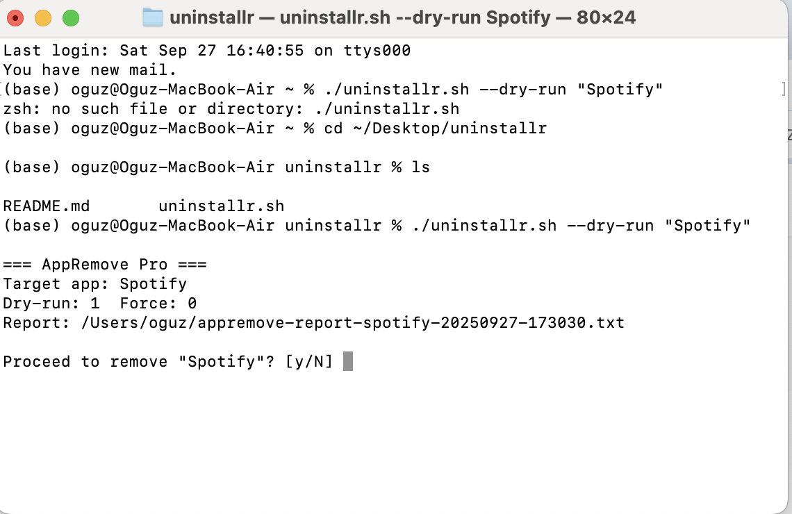

# 🧹 uninstallr

🔥 *"Remove apps like they never existed."*


---

## 🚀 Features
- Clean uninstall (app bundle + caches + plist)
- Dry-run mode (preview before delete)
- Force mode (no mercy 🔨)
- Homebrew support (tap + install)

---

## 📦 Installation

### 🔹 Homebrew
```bash
brew tap oguzcamurr/uninstallr
brew install uninstallr

🔹 Manual
git clone https://github.com/oguzcamurr/uninstallr.git
cd uninstallr
chmod +x uninstallr.sh
./uninstallr.sh --dry-run "Spotify"


🛠 Usage
uninstallr --dry-run "Spotify"   # Preview delete
uninstallr "Spotify"             # Full delete
uninstallr --force "Discord"     # No questions asked

## 📸 CLI Preview



🗺 Roadmap

 CLI Base Script

 Homebrew Formula

 GUI App (coming soon)

 DMG Installer
