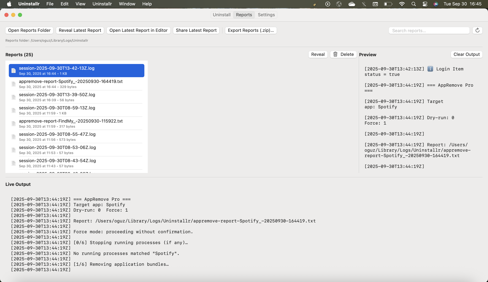
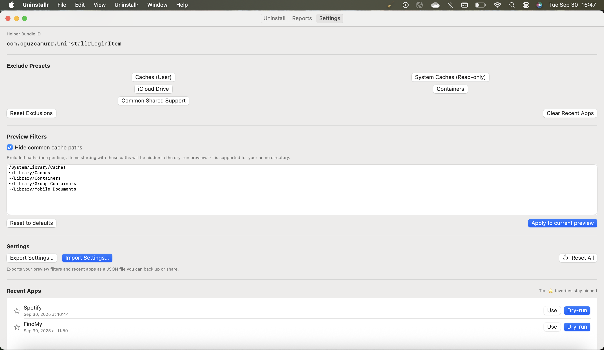

# 🧹 Uninstallr

A lightweight macOS app to completely uninstall applications and their related files.  
Built with **SwiftUI** + **AppKit integration**.

---

## ✨ Features
- 🔍 Scan for installed apps  
- 🗑️ Remove apps with related caches, receipts, and leftover files  
- 📊 Detailed uninstall reports  
- ⚙️ Preferences panel  
- 🌙 Dark mode support  

---

## 🚀 Installation
1. Download the latest release from [Releases](https://github.com/oguzcamurr/uninstallr/releases).  
2. Drag **Uninstallr.app** into your **Applications** folder.  
3. Open the app and start cleaning!  

⚠️ On first launch, macOS may ask for **Full Disk Access** in:  
`System Settings → Privacy & Security → Full Disk Access`.

---

## 📸 Screenshots
| Main View | Reports | Settings |
|-----------|---------|----------|
|  |  |  |

---

## 🛠️ Development
Clone the repository and open with **Xcode**:

```bash
git clone https://github.com/oguzcamurr/uninstallr.git
cd uninstallr
open Uninstallr.xcodeproj
